# A08 GrooveGalaxy

## Team

| Number | Name              | User                                     | E-mail                                |
| -------|-------------------|----------------------------------        | --------------------------------------|
| 99275  | Mário Santos      | <https://github.com/mario-santosgithub>  | <marioguilherme@tecnico.ulisboa.pt>   |
| 99261  | Juliana Marcelino | <https://github.com/julianafmar>         | <juliana.marcelino@tecnico.ulisboa.pt>|
| 99236  | Inês Pissarra     | <https://github.com/inespissarra>        | <ines.pissarra@tecnico.ulisboa.pt>    |


  

## Contents

This repository contains documentation and source code for the *Network and Computer Security (SIRS)* project.

The [REPORT](REPORT.md) document provides a detailed overview of the key technical decisions and various components of the implemented project.
It offers insights into the rationale behind these choices, the project's architecture, and the impact of these decisions on the overall functionality and performance of the system.

This document presents installation and demonstration instructions.

*(adapt all of the following to your project, changing to the specific Linux distributions, programming languages, libraries, etc)*

## Installation

To see the project in action, it is necessary to setup a virtual environment, with 4 networks and 5 machines.  

The following diagram shows the networks and machines:

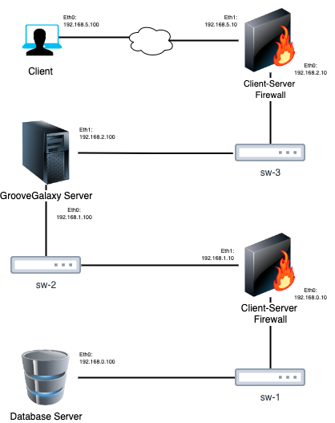

### Prerequisites

All the virtual machines are based on: Linux 64-bit, Kali 2023.2a

[Download](https://turbina.gsd.inesc-id.pt/csf2324/resources/kali-linux-2023.2a-installer-amd64.iso)
and [install](https://www.kali.org/docs/virtualization/install-virtualbox-guest-vm/) a virtual machine of Kali Linux 2023.2a.

[Here](https://github.com/tecnico-sec/Setup/blob/master/KaliSetup.md) you can find a guide to setup the Kali Linux virtual machine.

Clone the base machine to create the other machines.

You will also need the following tools:
- Java (which usually comes pre-installed in this distribution)
- Maven 
- MariaDB (probably already installed)

Install:
```
sudo apt update
sudo apt install mariadb-server
sudo apt install maven
```

### Machine configurations

The machines are configured as follows:

| Machine name | Subnet | Adapter | Adapter Name |
|:---:|:---:|:---:|:---:|
| __Database Server__ |
| 1 | 192.168.0.100 | eth0  | sw-1
| __Server-Database Firewall__ |
| 1 | 192.168.0.10 | eth0  | sw-1
| 2 | 192.168.1.10 | eth1  | sw-2
| __Groove Galaxy Server__ |
| 1 | 192.168.1.100 | eth0 | sw-2
| 2 | 192.168.2.100 | eth1 | sw-3
| __Client-Server Firewall__ |
| 1 | 192.168.2.10 | eth0  | sw-3
| 2 | INTERNET (192.168.5.10) | eth1 |
| __Groove Galaxy Client__ |
| 1 | INTERNET (192.168.5.100) | eth0 |

For each machine, there is an initialization script with the machine name, with suffix `.sh`, that installs all the necessary packages and makes almost all required configurations in the a clean machine.

Inside each machine, use Git to obtain a copy of all the scripts and code.

```sh
$ git clone https://github.com/tecnico-sec/a08-mario-juliana-ines
```

Go to the directory `a08-mario-juliana-ines/scripts` and:

Give permissions to the scripts:
```sh
$ sudo chmod 777 *.sh
```

Execute the initial script in the admin machine (in the main folder, a08-mario-juliana-ines):
```sh
$ sudo ./scripts/admin
```

This will create certificates and keys for the machines and networks, and will copy them to the respective folders. Machine folders must be updated with the new files

Next we have custom instructions for each machine.

#### Database Server Machine

This machine runs the database server 10.11.5-MariaDB-3.

It will be necessary to change the bind address in the file `/etc/mysql/mariadb.conf.d/50-server.cnf` to the IP address of the machine, in this case

```
$ sudo nano /etc/mysql/mariadb.conf.d/50-server.cnf

        ...
        bind-address = 192.168.0.100
        ...
```

Then, append to the `/etc/mysql/my.cnf` file the following lines:
```
$ sudo nano /etc/mysql/my.cnf

        [mysqld]
        ssl-ca=/etc/mysql/ssl/ca.pem
        ssl-cert=/etc/mysql/ssl/database-cert.pem
        ssl-key=/etc/mysql/ssl/database.pem

        innodb_encrypt_tables=ON
        plugin_load_add = file_key_management
        file_key_management_filename = /etc/mysql/encryption/keyfile.enc
        file_key_management_filekey = FILE:/etc/mysql/encryption/keyfile.key

```

Finally, run the script `database.sh` in Database folder to install the database server (the script must have permissions to execute).
``` 
$ sudo ../scripts/database.sh
```

Restart the database server and check if everything is working
```
$ sudo systemctl restart mariadb.service
$ sudo mysql -u root -b -e "SHOW GLOBAL VARIABLES like 'bind_address'"
$ sudo mysql -u root -b -e "SHOW GLOBAL VARIABLES like '%ssl%'"
$ sudo mysql -u root -b -e "SHOW PLUGINS"
```

The variable `bind_address` should be `192.168.0.100` and the variable `have_openssl` should be `YES`. The plugin `file_key_management` should be `ACTIVE`.


If you receive the following message
```
ERROR 2002 (HY000): Can't connect to local server through socket '/run/mysqld/mysqld.sock' (2)
``` 
then
```sh
$ sudo systemctl restart mariadb.service
```

If the server cannot connect to the database
```sh
$ sudo mysql -u root
    ALTER USER 'root'@'localhost' IDENTIFIED VIA mysql_native_password USING PASSWORD('');
```

#### Server-Database Firewall Machine

This machine runs the firewall that protects the database server.

Run the script `server-database-firewall.sh` in the main folder (a08-mario-juliana-ines) to install the firewall (the script must have permissions to execute).
```
$ sudo ./scripts/firewall_server-database.sh
```

#### Groove Galaxy Server Machine

This machine runs the Groove Galaxy server.

Run the script `GrooveGalaxyServer.sh` in the main folder (a08-mario-juliana-ines) to install the server (the script must have permissions to execute).
```
$ sudo ./scripts/GrooveGalaxyServer.sh
```

Compile the server code and run it
```
$ mvn clean install
$ cd GrooveGalaxyServer 
$ mvn exec:java -Dexec.args="8080 192.168.0.100 3306 SIRS"
```

#### Client-Server Firewall Machine

This machine runs the firewall that protects the Groove Galaxy server.

Run the script `firewall_client-server.sh` in the main folder (a08-mario-juliana-ines) to install the firewall (the script must have permissions to execute).
```
$ sudo ./scripts/firewall_client-server.sh
```

#### Groove Galaxy Client Machine

This machine runs the Groove Galaxy client.

Run the script `client.sh` in the main folder (a08-mario-juliana-ines) to install the client (the script must have permissions to execute).
```
$ sudo ./scripts/client.sh
```

Compile the client code and run it
```
$ mvn clean install
$ cd Client
$ mvn exec:java -Dexec.args="192.168.5.10 8080" 
```

## Demonstration

Now that all the networks and machines are up and running, ...

We can verify, with wireshark, that all the messages between the machines are encrypted and authenticated.
#### Client-Server Messages without encryption
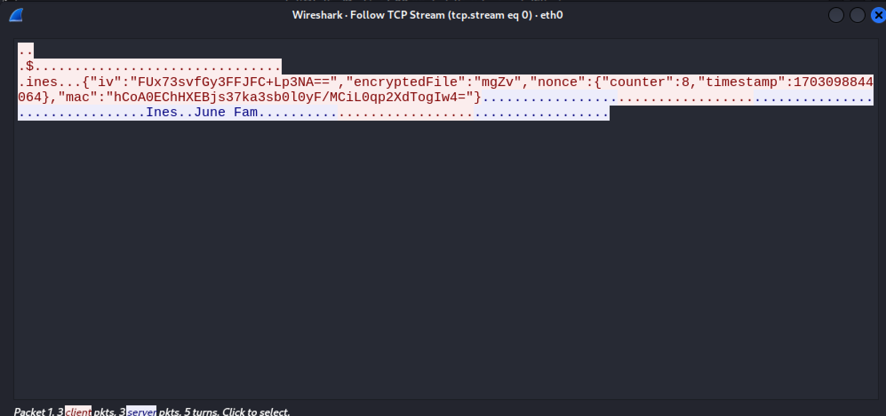

#### Client-Server Messages with encryption


#### Server-Database Messages without encryption
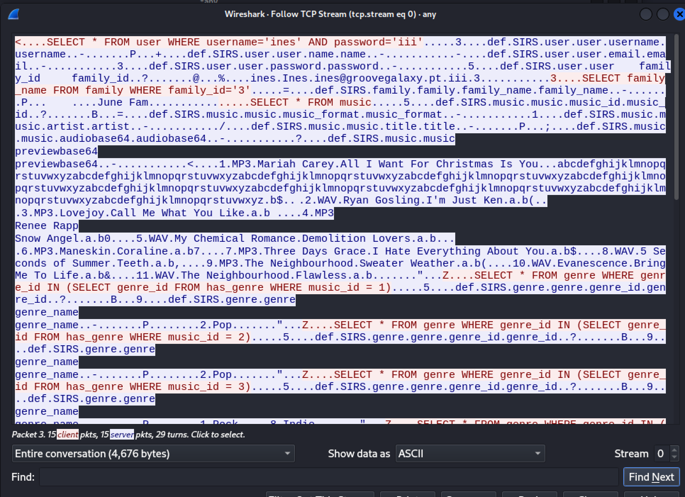

#### Server-Database Messages with encryption
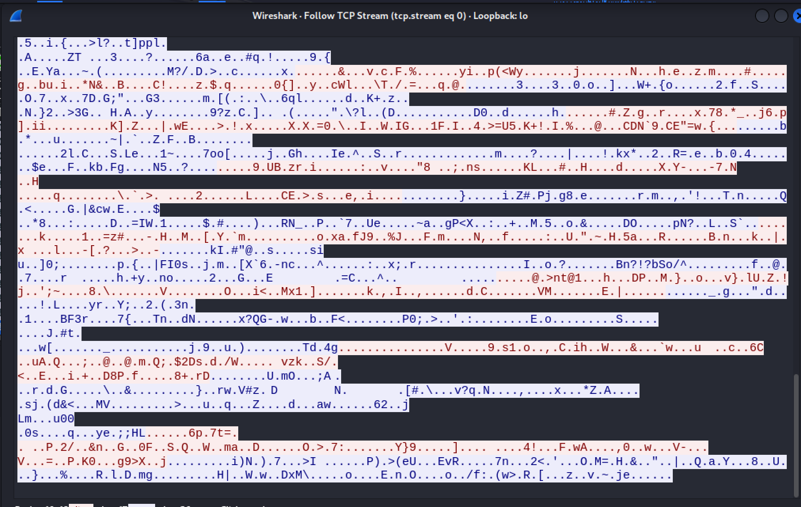

### Tour of the Application

The application opens with a menu that allows the user to perform various actions.

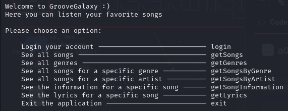

#### Principal Menu:

##### login - Login with an existing account

###### Client side
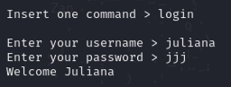

###### Server side
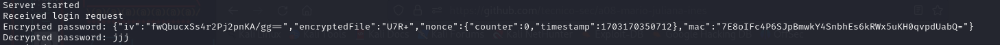

##### getSongs - See all of the existing songs

###### Client side


###### Server side
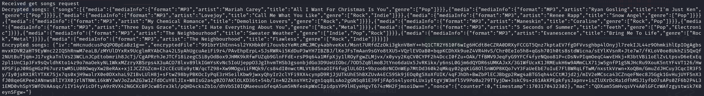

##### getMySongs - See all of the songs you bought

###### Client side


###### Server side
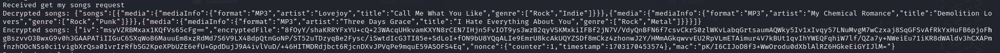

##### getLyrics - See the lyrics of any song

###### Client side
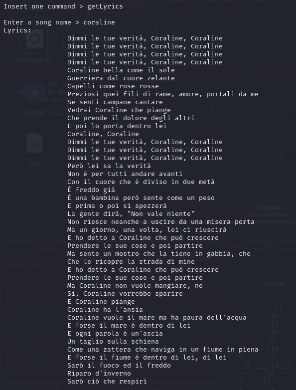

###### Server side
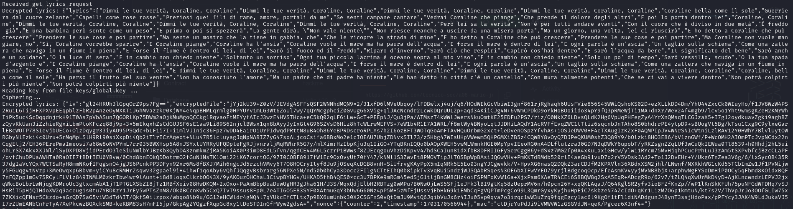

#### play - Play a song that you bought previously

###### Client side
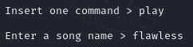

###### Server side
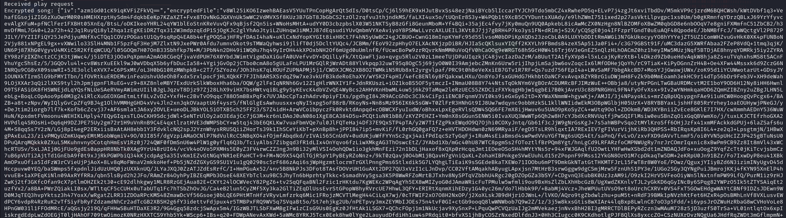

#### Other operations:
- getGenres - See all of the existing genres.
- buySong - Buy a song.
- getSongsByGenre - See all of the songs of a genre.
- getSongsByArtist - See all of the songs of an artist.
- getSongInformation - See the information of a song.
- getPreview - Listen to a little preview of a song. It opens a media player and plays the song.
- playMiddle - Play a song from the middle. It outputs the audio in base64 from the middle - inputed by the user - to the end of the song.
- family - Enter the family menu.
- logout - Logout of your account.
- exit - Exit the application.

#### Family Menu:

A menu that allows the user to perform various actions related to the family plan.

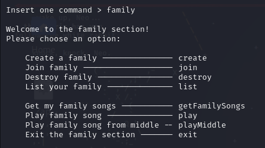

##### create - Create a family

###### Client side
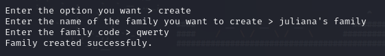

###### Server side
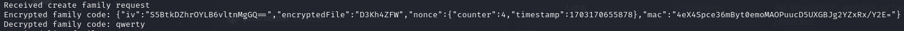

##### getFamilySongs - See the songs owned by members of the family

###### Client side


###### Server side
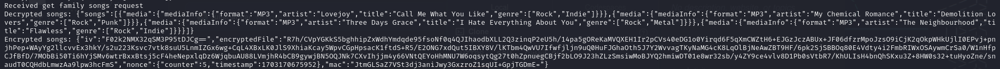

##### Other operations:
- join - Join an existent family
- destroy - Delete your family
- list - List your family members
- play - Play a song owned by a family member. It opens a media player and plays the song.
- playMiddle - Play a song owned by a family member from the middle. It outputs the audio in base64 from the middle - inputed by the user - to the end of the song.
- exit - Exit family menu

#### Hacker command:
###### This command simulates a replay attack. The answer were the same if the message was old (timestamp difference too high) or changed (MAC verification failed).

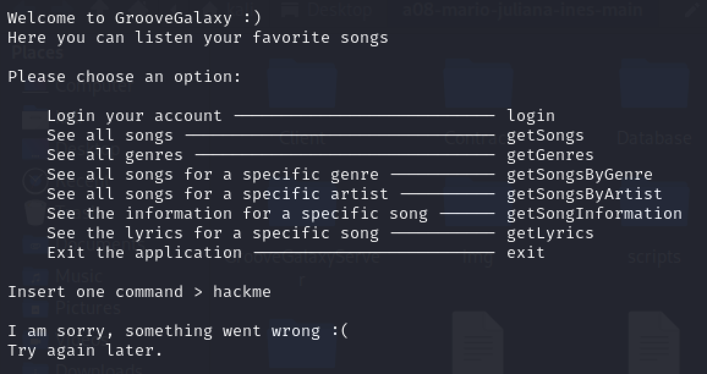

This concludes the demonstration.

## Additional Information

### Links to Used Tools and Libraries

- [Java 11.0.16.1](https://openjdk.java.net/)
- [Maven 3.9.5](https://maven.apache.org/)
- [MariaDB 10.11.5-MariaDB-3](https://mariadb.org/)
- [MariaDB TLS](https://mariadb.com/kb/en/securing-connections-for-client-and-server/)
- [GRPC 1.41.0](https://grpc.io/)
- [GRPC TLS](https://grpc.io/docs/guides/auth/)

### License

This project is licensed under the MIT License - see the [LICENSE.txt](LICENSE.txt) for details.

----
END OF README
