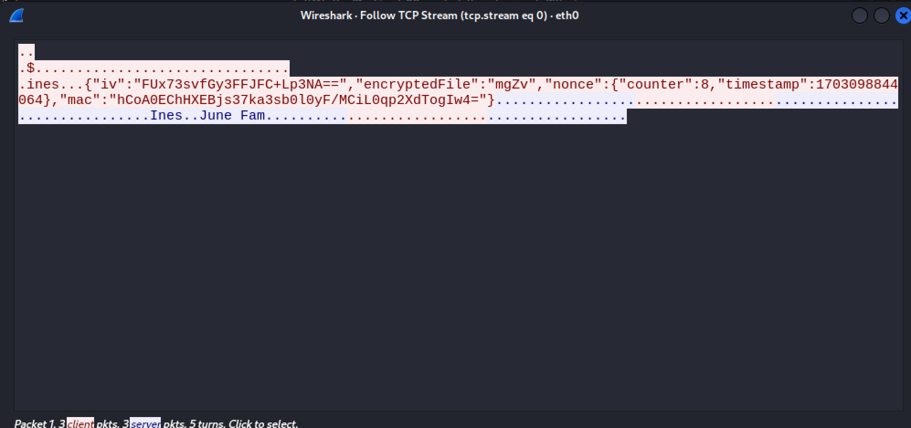
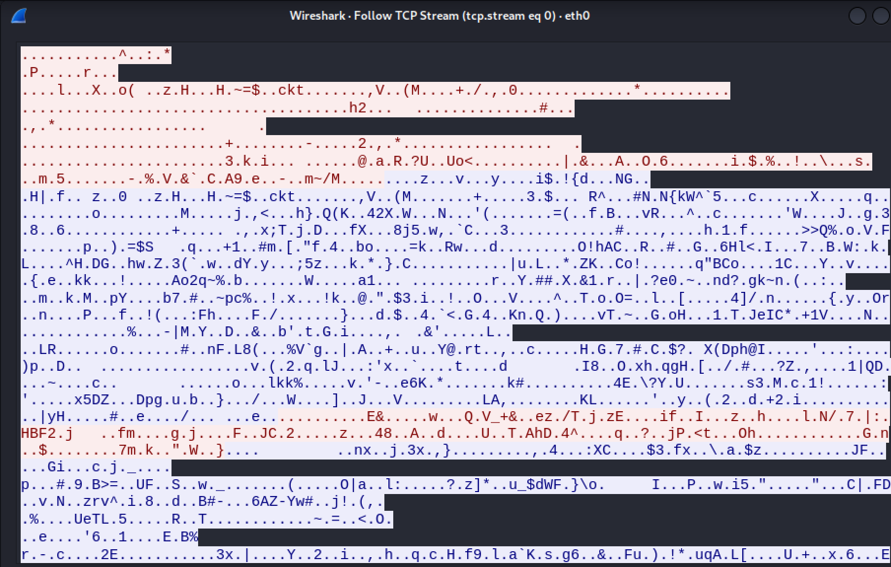

# A08 GrooveGalaxy

## 1. Introduction

The GrooveGalaxy is a multi-server application that aims to develop a system for streaming music. The system allows users to connect individually or in family mode, this way they can buy music and have access to family's music.

There are two important "regions" of the app, an internal network, where the backend (database + main server) and a public network that allows connection between the client and the app itself (client and main server).

The GrooveGalaxy app has:
- Two **Firewall** that set the rules of which machines can communicate with each other.
- A **Client** that can send requests to listen to music or manage their account.
- A **Server** (GrooveGalaxyServer) that manages all the requests and responses from and to the client and database.
- A **Database** to store the information regarding the users and the songs.

### Technology Used:
- Java Programming Language
- gRPC with TLS: method for the remote calls between the client and server communication while securing it with keys
- Maven: build automation tool for Java projects
- Protobuf: cross-platform data format used to serialize structured data 

### Secure Documents

The project also contains a bunch of documents that assert the security of the information sent between all the machines.

#### JsonWriter.java:
The purpose of this class is to write a JSON file from the characteristics of a song. Those characteristics are:
- The file name.
- The name of the song.
- The format of the file (mp3, WAV).
- The artist.
- The title.
- The number of genres that the song has.
- The number of lyrics that the song has.
- The audioBase64.

#### Check.java: 
This class aims to verify a document's integrity using MAC and nonce (MAC + timestamp). It checks if the MAC and nonce exist and are correct, preventing replay attacks and ensuring the messages' order. If both checks are successful, the document is considered valid.

This class was created to facilitate testing, and for simplification purposes, it only admits one word per array position.

#### Protect.java:
This class provides functionalities to protect a JSON file by encrypting its content and adding integrity checks using a MAC. AES is used to encrypt the files. 

#### Unprotect.java:
This class is responsible for undoing what the Protect class is doing. It receives a protected message and decrypts it, calling the Check class to verify the integrity.

#### SecureDocumentsTool.java:
Main class that manages all the secure documents.

### Initial Scripts

- **admin.sh** -> generates the certificates for the client, server, and database.
- **client.sh** -> sets the IP address for the client.
- **database.sh** -> sets the IP address, and creates and populates the database.
- **firewall_client-server.sh** -> sets the rules for the firewall between the client and the server.
- **firewall_server-database.sh** -> sets the rules for the firewall between the server and the database.
- **GrooveGalaxyServer.sh** -> sets the IP addresses for the server machine network

### Security Challenge
Our security challenge consists of allowing a user to enter family mode and play music from another member of the family.
In order to make it possible, we decided to create family keys and send them to the users when they join the family.
The second part of the security challenge is to allow the user to play a music from the middle, that is, the user can choose the instant of the music that he wants to play.

### Structure Of The System
Here is a simple representation of the structure of the GrooveGalaxy:


Here is a simple representation of the structure of the Database:


## 2. Project Development

### 2.1. Secure Document Format

#### 2.1.1. Design

The secure documents are made of the following classes:

**JsonWriter** - responsible for creating a JSON representation of the media information (mentioned above) and then storing it in a new file.

**Check** - responsible for verifying the integrity and authenticity of protected files using HMAC-SHA256 for message authentication and a counter and timestamp for replay attack prevention and out-of-order messages. 

**Protect** - protects the confidentiality and integrity of a JSON file, using symmetric encryption, AES in CTR mode, to encrypt the content. It also generates a random Initialization Vector, which is used to encrypt and then calls the Check class to create the MAC - Message Authentication Code.
It then outputs a JsonObject containing the IV, encrypted file, nonce, and MAC.

**Unprotect** - reverses the protection process. Verifies the integrity of the file using the Check class, reads the key, IV, and the content from the JSON used as input. After decrypting, the file stores the resulting JSON in an output file.

**SecureDocumentsTool** - this class works as a command-line interface for the operations mentioned above (protect, unprotect, check, help)

Design Choices and Rationale:

- AES in CTR mode is chosen for symmetric encryption. The CTR mode allowed us to decrypt the file from the middle, therefore managing to start the music from the middle safely (without needing to decrypt the entire file). This mode has the advantage of parallelization and efficiency. 
- The use of a random Initialization Vector (IV) enhances security.
- HMAC-SHA256 is used for computing the MAC to ensure the integrity of the data.
- A nonce (counter + timestamp) is included in the protected file to prevent replay attacks (counter) and out-of-order messages (timestamp, we found this important). This approach has the advantage of achieving the objective in a simple and effective way. On the other hand, it requires that the clocks are synchronized and that the counter is stored in a persistent way.
It consists of a counter and a timestamp.
- IV, counter and timestamp are stored in the JSON file and are not encrypted, that is, a hacker will be able to see them. However, these are included in the MAC, which means they cannot be changed. As the hacker does not know the key, he will not be able to take advantage of them either.
- We decided to use the encrypt-then-MAC technique, as it allows us to verify the integrity of the file before decrypting.
- Keys are read from files securely and used to derive secret keys for encryption and MAC computation.
- SecureDocumentsTool provides a user-friendly command-line interface for various operations.

**Examples of the data format:**

JSON Structure - Generated by JsonWriter
```json 
{
  "media": {
    "mediaInfo": {
      "owner": "name",
      "format": "format",
      "artist": "artist",
      "title": "title",
      "genre": ["genre1", "genre2"],
    },
    "mediaContent": {
      "lyrics": ["lyric1", "lyric2"],
      "audioBase64": "base64-encoded-audio"
    }
  }
} 
```

JSON Structure - Generated by Protect
```json 
{
  "iv": "base64-encoded-iv",
  "encryptedFile": "base64-encoded-encrypted-file",
  "nonce": {
    "counter": 0,
    "timestamp": 123456789
  },
  "mac": "base64-encoded-mac"
}
```

Example of an execution of the SecureDocumentsTool:
``` 
$ mvn clean install
$ export PATH=$PATH:/home/kali/Desktop/a08-mario-juliana-ines-main/SecureDocument/target/appassembler/bin
```

(Replace `/home/kali/Desktop/` with the path to the project folder in your computer)

```
$ write-json-file file.json Happy mp3 happy memyselfandi 1 rock 1 memyselfandi 2345678654dfghsdf

$ cat file.json                                                                         
{
  "media": {
    "mediaInfo": {
      "owner": "Happy",
      "format": "mp3",
      "artist": "happy",
      "title": "memyselfandi",
      "genre": [
        "rock"
      ]
    },
    "mediaContent": {
      "lyrics": [
        "memyselfandi"
      ],
      "audioBase64": "2345678654dfghsdf"
    }
  }
}  

$ secure-document protect file.json output_file path/to/key.key

$ cat output_file 
{"iv":"SSpucX47XJingFp6pjXr3g\u003d\u003d","encryptedFile":"TY3070t2FpkKePlFO5OSmCz4+p4Bgew5v795gXXowJxKqv8t6RBv5WxErOro5lZ7e2VjKGqmlWUA2m4a5UjCn5w/BPrUyOQtAn22UpSun+nIVsVffOFQAAyVlWF09agKK0VfvgPYH7p+JMOxZmFH4KVAHR1X24JotsRTP1eToFyUCsflaBaOyDt1FLn2UQ9DB0gbyEp3vwkP+zS38KdQxxvzRU0y+kFsWPtwZzQlqC1DkIn0ilullzRX99Zleg\u003d\u003d","nonce":{"counter":1,"timestamp":1703171147885},"mac":"Pn4isZhGyuT3EirIHnZfrgf8C7inf36QxKk66GeIaHU\u003d"}

$ secure-document unprotect output_file file2.json path/to/key.key

$ cat file2.json        
{
  "media": {
    "mediaInfo": {
      "owner": "Happy",
      "format": "mp3",
      "artist": "happy",
      "title": "memyselfandi",
      "genre": [
        "rock"
      ]
    },
    "mediaContent": {
      "lyrics": [
        "memyselfandi"
      ],
      "audioBase64": "2345678654dfghsdf"
    }
  }
}


$ secure-document check output_file path/to/key.key
Verifying MAC...
MAC is right
Verifying nonce...
Nonce is right
```

#### 2.1.2. Implementation

In order to implement the secure documents, besides java programming language, some other cryptographic libraries are used:

- javax.crypto
- java.security
- com.google.gson

**Implementation Steps**

JsonWriter
1. Accepts media information and the output file name.
2. Creates a JSON object using the Gson library to represent the content.
3. Writes the JSON object and creates the new file with FileWriter.

Protect
1. Reads the original JSON file using the Gson library.
2. Generates a random Initialization Vector using SecureRandom.
3. Encrypts the content using AES in CBC mode with the generated vector.
4. Computes a MAC using HMAC-SHA256.
5. Creates a new JSON, containing the content mentioned above.
6. Change the CBC mode to CTR mode.
7. Create keys dynamically.

Unprotect
1. Reads the protected JSON file using the Gson library.
2. Verifies the integrity and authenticity of the file using the Check class.
3. Reads the key, vector and encrypted content from the JSON.
4. Decrypts the file content using AES in CTR mode and the provided key and vector.
5. Writes the JSON object and creates the new file with FileWriter.
6. Create the option of unprotecting from the middle of the file - increments the IV and unprotect the necessary bytes.

Check
1. Reads the protected JSON file using the Gson library.
2. Takes the information from the file and calls verifyMAC for MAC verification and verifyNonce for nonce verification.
3. Checks the MAC using HMAC-SHA256.
4. Verifies the nonce.
5. Reads the key from a file using Java's FileInputStream.

**Security Challenge**

Initially, we had protected using the CBC mode, but to incorporate the security challenge, we changed to CTR, which is also safe and does not depend on the previous data in the file, allowing specific bytes to be decrypted.
We also had to add to the Protect class functions to create and write keys in order to be able to easily encrypt and decrypt the family keys and send them to the user.

### 2.2. Infrastructure

#### 2.2.1. Network and Machine Setup

The GrooveGalaxy's infrastructure is composed of an external network and an internal network:

- The external network is made only by the client machine, which will communicate with the server via internet.

- The internal network is made by the main server, GrooveGalaxyServer and the database, aswell as the firewalls.

In order to establish communication, and since we want high-frequency data updates with a client and a backed service, we decided to use gRPC. This method allows us to connect point-to-point real-time services that need to handle streaming requests and responses, just like our streaming app.


#### 2.2.2. Server Communication Security

The server communications are secured with TLS, which is created at the creation of the connection itself. To help establish this, gRPC offers  a library, netty, which supports NettyChannelBuilder, which is responsible for building the connection with TLS protection. 

Firstly, we need to generate public and private keys for the client and for the server, which is done with the ```admin.s``` script that was presented before.

- The Client connects with the certificate ```ca.crt```. This is the Certificate Authority (CA) certificate that is used to sign the client and server certificate.

- The server uses two certificate files to connect with the client, ```server.crt``` and ```server.key```. The first file is the public key certificate of the server, it contains information about the server such as the domain name, organization and public key. It is presented to the clients during the TLS handshake to establish the connection. The second file, ```server.key```, is the private key corresponding to the server certificate, it is confidential and it's used by the server to prove it's identity on the handshake.

- To connect with the database, the server uses two keys as well, ```serverAPI.p12``` and ```database-cert.pem```. The first file refers to the keystore, a repository of certificates of the server. The .pem file is the server's SSL certificate file. In this case, the server only trusts the database certificate since it is the only one that needs to be verified. 

In addition to all of this, the database is also encrypted using Data-At-Rest encryption. We did this using the file_key_management plugin, which allows us to store the key in a file and then encrypt the database with it. The key is also created with the ```admin.sh``` script.

The objective is for the admin to run the script on his computer and distribute the keys to the correct folders in machines when they are created. The README.md file explains in detail the steps to follow for this installation.

We left some keys (created with the ```admin.sh``` script) in the folders, so that the project can be tested quickly.

#### Here is the demonstration of using TLS in the connection and not using it:

Without TLS Client-Server protection:



With TLS Client-Server protection:



Without TLS Server-Database protection:


With TLS Server-Database protection:


### More about communication security

In addition to the TLS, each client (or user) has one personal key that is used to encrypt and decrypt the content of the requests and responses. 

It also has a global key that is used to encrypt and decrypt some less critical information (commands that are allowed when a user is not logged in, like getSongs, which lists the songs available).

User keys and global keys are also generated with the ```admin.sh``` script. It is stored in the client machine and in the server machine, so that both client and server can encrypt and decrypt the content of the requests and responses between them.

There are also 2 firewall, one between the client and the main server, and other between the server and the database. They deny all incoming and outgoing traffic by default with the "DROP" policy, allowing only eth0 and eth1 on a specific port, 8080 and IPs. The firewalls redirect the traffic to the correct machine.

### 2.3. Security Challenge

#### 2.3.1. Challenge Overview

The security challenge consists of allowing a user to enter family mode and play music from another member of the family. Additionally, the user can play a music from the middle, that is, the user can choose the instant of the music that he wants to play.

#### 2.3.2. Attacker Model

In our implementation, we considered that the server is fully trusted since it is the one that manages the database and the keys. The database is also fully trusted since it is encrypted with the file_key_management plugin. This ones have encrypted communication between them, so that the attacker cannot access the information. They are also protected by a firewall so that attackers cannot access the machines.
The client is untrusted since he can be an attacker trying to access unauthorized information.
We considered that the administrator is also trusted since he is the one who creates the keys and distributes them to the correct machines.

The attacker can gain access to the client machine and get the key. This way, he can decrypt the information that the client sends to the server and vice-versa. 
The attacker can also be a malicious employee (like an admin) who has access to the server and database and can get the keys.
The attacker could check and change some of the client messages if there is no TLS but doesn't have access to the response of the server since it is encrypted with the key. Critical information like passwords is encrypted with the client key, doubling security.
The attacker cannot do SQL injection because our solution is protected against it. 

#### 2.3.3. Solution Design and Implementation

In order to overcome this challenge, we had to:

1. create the concept of family: A family can be created by a user who sets the family name and its code. If the client wants to join the family, he needs to insert the family code. When he does that, he is added to the family, and the family key is sent to him. This key is encrypted with the user key. By adding this new concept, the database needed an update so that it could store the information of families as well as the user's table to include an attribute that references the family id. When the user wants music from the family, he can just go to the family menu and play the music.

2. create new functions in Protect class to handle the dynamic distribution of keys.

3. create a new command to allow the user to play music from the middle.

4. change the CBC mode to CTR mode so that the user can play the music from the middle.

5. create new functions in Unprotect class to decrypt files from the middle.

## 3. Conclusion

We feel that we learned a lot about the various encryption modes, TLS and database encryption, managing to achieve the project's main objective of encrypting communications with several levels of security.
We think we have achieved most of the objectives described in the statement, such as TLS, the secure document tool, and the creation of firewalls. 
On the other hand, the application interface is not 100% complete in the sense that some inputs could generate errors, also breaking security. 
The playMiddle command (playing a song from the middle) is not completely functional, but all the encryption behind it is implemented. 
The songs in base64audio were too long, so we ended up leaving just a snippet of the song.
If we had more time, we would have liked to complete the interface in order to make it more secure, user friendly and do more commands.

We really liked the idea of the project, and it’s a theme that suits us a lot. The concepts learned will be useful for our career as computer engineers. We wish we had more time to finish our application and do everything we wanted to do.

## 4. Bibliography

https://mariadb.com/kb/en/file-key-management-encryption-plugin/

https://chat.openai.com/

----
END OF REPORT
